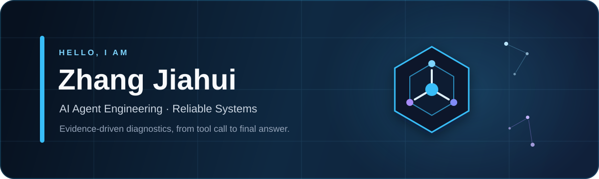

<div align="center">
  
</div>

<div align="center">
  <a href="https://github.com/1dongdongyang1?tab=followers">
    
  </a>
</div>

## Hi, I'm Zhang Jiahui 👋

I'm a student at **Shanxi University**, focused on building AI agents that are bounded, observable, and grounded in evidence.

我关注 **AI Agent 工程化、工具调用、RAG 与可靠性诊断**。相比只展示一次成功的 Demo，我更在意系统是否能说明：调用了什么工具、依据是什么、哪些结论仍然未知，以及何时应该停止并交给人工。

```text
alert / question → collect read-only evidence → reason within boundaries → produce a verifiable answer
```

## Featured projects

| Project | What it demonstrates | Stack |
| :--- | :--- | :--- |
| **[OnCall Agent](https://github.com/1dongdongyang1/OnCall)** | A TypeScript incident-response agent that connects failure descriptions, read-only evidence collection, SOP retrieval, and grounded recommendations. Includes controlled Tool Calling and retrieval evaluation. | TypeScript · Node.js · DeepSeek · RAG |
| **[GPU Diagnosis Agent](https://github.com/1dongdongyang1/gpu-agent)** | A deterministic, read-only GPU diagnosis agent with explicit budgets, policy checks, loop guards, evidence references, and failure-path tests. | Go · Mock Data · Agent Runtime |
| **[Knowledge](https://github.com/1dongdongyang1/knowledge)** | An Obsidian knowledge base for turning learning notes and engineering practice into reusable knowledge. | Markdown · Obsidian |

## Tech & tools

<div align="center">
  
  
  
  
  
  
  
  
</div>

## How I build

- **Evidence before conclusions** — keep observed facts, inferences, unknowns, and recommendations separate.
- **Boundaries in code** — deterministic components own scope, permissions, budgets, and termination.
- **Replaceable integrations** — isolate mock data behind interfaces so real systems can be connected without rewriting tool contracts.
- **Evaluation over intuition** — test retrieval quality and agent behavior with explicit expected evidence and failure cases.

<div align="center">
  <sub>Always learning. Always making the system easier to explain.</sub>
</div>
